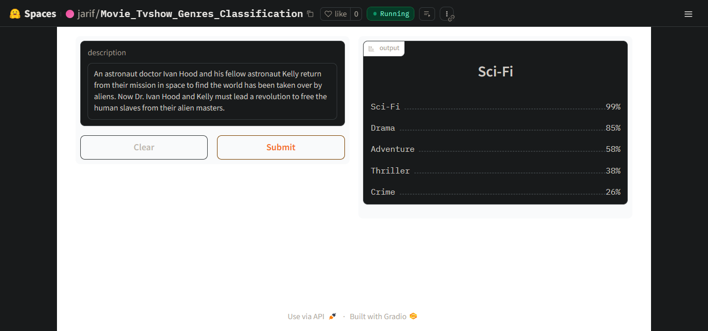
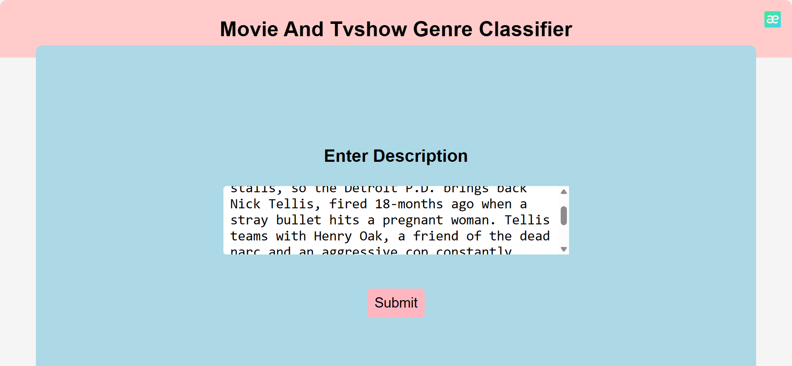
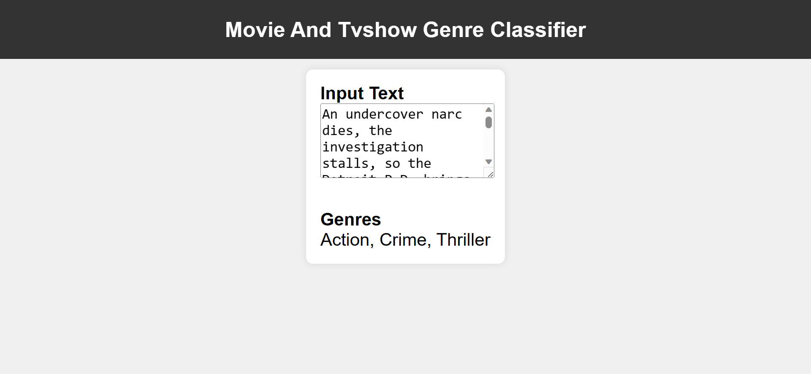

# Movie_Tvshow_Genre_Classification

***From gathering data to model training and deployment, the entire journey of creating a text classification model has been completed. This model demonstrates proficiency in classifying a diverse range of 23 Movie and TV show genres. The deployment section contains a key resource, namely genre_types_encoded.json, providing insights into the encoded representations of these genres for both Movies and TV shows. Explore this file to gain a deeper understanding of the genres encompassed by the model.***

# Genre Countplot

> The countplot visually represents the distribution of genres, giving you insights into the variety of content covered in the project. The x-axis displays the different genres, while the y-axis shows the corresponding count for each genre.

# Description WordCloud

> The description word cloud gives a visual representation of the most frequent words used in project descriptions. This helps users quickly grasp the main themes and focus areas of the project

# Genre WordCloud

> Explore the genre word cloud to gain insights into the diverse categories covered by the project. Each word represents a genre, and the size corresponds to the frequency of that genre in the project

# Most Common Words in Description

> Here are the 30 most common words in descriptions

# Data Preprocessing

***In the dataset's initial state, it comprised 27 distinct genres. Subsequent analysis revealed that four of these genres appeared to be uncommon, potentially representing custom genres created by users. Consequently, these rare genres were excluded, leaving a refined dataset containing 23 genres.Further refinement involved the removal of descriptions lacking any associated genres. As a result, the dataset now comprises 21,753 samples, each with a well-defined genre.***

# Model Training

***I performed fine-tuning on a pre-trained Roberta-Base model obtained from HuggingFace Transformers. The process utilized the Fastai library and Blurr, an extension for leveraging HuggingFace Transformers with Fastai. For those interested, the notebook used for training the model is accessible and can be viewed for detailed insights into the training procedure [here](https://github.com/jarif87/Movie_Tvshow_Genre_Classification/blob/main/notebooks/movie_tvshow_genres_Classification.ipynb)***

# Model Deployment

***The condensed model has been deployed on the HuggingFace Spaces Gradio App. You can explore the implementation either by navigating to the deployment folder or by visiting this [link](https://huggingface.co/spaces/jarif/Movie_Tvshow_Genres_Classification) for direct access to the application.***

# Web Deployment

***Launched a Flask App designed to receive descriptions and generate corresponding genres as output. Feel free to explore the Flask branch for implementation details. You can experience the application in real-time by visiting the live website, accessible [here](https://multilabel-movietvshow-genre-classifier.onrender.com)***

